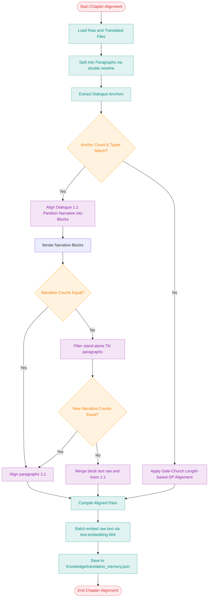

# Chapter Alignment & Paragraph Count Analysis

This analysis investigates the structural alignment of the Japanese raw chapters (`生肉/1.神んてらの世界`) and Chinese translated chapters (`熟肉/Ntera神的世界`) for chapters 1-18. It details paragraph mismatches, their causes, and the architectural design of a robust paragraph alignment engine to initialise the Translation Memory (TM).

---

## 1. Paragraph Count & Line Comparison (Chapters 1-18)

By analysing the raw and translated files, we observe that the novel's formatting follows a consistent alternating structure: one line of text followed by a blank line. For a chapter with $L$ lines, the paragraph count is exactly $(L + 1) / 2$. Mismatches between raw and translated chapters are common.

| Chapter | Raw Lines ($L_{raw}$) | Raw Paragraphs ($P_{raw}$) | Trans Lines ($L_{trans}$) | Trans Paragraphs ($P_{trans}$) | Paragraph Match? | Primary Cause of Mismatch |
| :--- | :---: | :---: | :---: | :---: | :---: | :--- |
| **Ch 1** | 173 | 87 | 177 | 89 | **No** (+2) | 1 translator note (TN) paragraph; 2 splits; 1 merge. |
| **Ch 2** | 125 | 63 | 125 | 63 | **Yes** | 1:1 structure matching. All TNs are inline. |
| **Ch 3** | 163 | 82 | 163 | 82 | **Yes** | 1:1 structure matching. All TNs are inline. |
| **Ch 4** | 129 | 65 | 137 | 69 | **No** (+4) | Added TN paragraphs and split narrative sentences. |
| **Ch 5** | 153 | 77 | 157 | 79 | **No** (+2) | 2 separate TN paragraphs (Lines 117 and 137). |
| **Ch 6** | 149 | 75 | 151 | 76 | **No** (+1) | 1 separate TN paragraph. |
| **Ch 7** | 185 | 93 | 181 | 91 | **No** (-2) | Narrative paragraph merging by translator. |
| **Ch 8** | 189 | 95 | 177 | 89 | **No** (-6) | Significant paragraph merging. |
| **Ch 9** | 149 | 75 | 147 | 74 | **No** (-1) | Merged dialogue tags or narrative. |
| **Ch 10**| 201 | 101 | 201 | 101 | **Yes** | 1:1 structure matching. All TNs are inline. |
| **Ch 11**| 171 | 86 | 181 | 91 | **No** (+5) | Multiple split paragraphs for readability. |
| **Ch 12**| 177 | 89 | 203 | 102 | **No** (+13) | High density of TNs and short sentence splits. |
| **Ch 13**| 237 | 119 | 227 | 114 | **No** (-5) | Paragraph merging and formatting compression. |
| **Ch 14**| 161 | 81 | 157 | 79 | **No** (-2) | Merged paragraphs. |
| **Ch 15**| 131 | 66 | 113 | 57 | **No** (-9) | Major narrative paragraph merging. |
| **Ch 16**| 197 | 99 | 187 | 94 | **No** (-5) | Narrative block consolidation. |
| **Ch 17**| 213 | 107 | 199 | 100 | **No** (-7) | Merged narrative paragraphs. |
| **Ch 18**| 207 | 104 | 204 | 102 | **No** (-2) | Missing blank line (lines 3-4) and paragraph merges. |

---

## 2. Qualitative Mismatch Analysis

Through direct manual inspection of Chapters 1, 5, 10, and 18, we categorised four distinct classes of paragraph mismatches:

### A. Translator Notes (TNs) as Separate Paragraphs
The translator frequently inserts translation notes, explanations of cultural references (e.g. *Neta* jokes, wordplay, and regional slang), or character-role notes as standalone paragraphs.
*   **Example from Chapter 5, Translated Line 117**:
    ```markdown
    （译：男主大喊了一句「僕頑張りマメ！（我是努力豆！）」，这句话的发音和「僕頑張ります！（我会努力的！）」几乎完全一致。）
    ```
    This paragraph does not exist in the raw file, causing a +1 paragraph count shift in the translated chapter.
*   **Example from Chapter 5, Translated Line 137**:
    ```markdown
    （译：慎一郎试图通过强行扮演语无伦次的奇怪动漫角色，来覆盖掉自己原本“内向奥手”的危险初始设定。）
    ```
    This adds another standalone paragraph. In contrast, in Chapter 10 and Chapter 2, similar notes are appended *inline* within the preceding paragraph (e.g. `……那玩意儿（注：...）`), preserving the 1:1 paragraph ratio.

### B. Paragraph Splitting
Long Japanese narrative blocks or compound sentences are occasionally split into multiple shorter Chinese paragraphs to improve visual flow and readability.
*   **Example from Chapter 1, Raw Line 167**:
    ```text
    そして必死に走りながら記憶の前世というか、自分がどんな人生を歩んでいたかとか、どういう風に死んだのかなどを思い出そうとするも上手くいかない。
    ```
    This is translated and split into two distinct paragraphs (Lines 167 and 169 in translated):
    ```markdown
    我拼命奔跑，同时试图回想前世的记忆——自己究竟过着怎样的人生？又是如何死去的？

    然而，这些关键信息无论如何都想不起来。
    ```

### C. Paragraph Merging
The translator sometimes combines multiple short, fragmented Japanese narrative lines into a single, cohesive Chinese paragraph.
*   **Example from Chapter 1, Raw Lines 51 and 53**:
    ```text
    実はそのエロ漫画、過去の描写が親切ご丁寧だったのだ。
    （空行）
    それこそ、悪魔的なまでに。
    ```
    These are consolidated into a single translated paragraph at line 51:
    ```markdown
    其实，那部成人漫画对过去的描写异常详尽，甚至到了堪称「恶魔级别」的地步。
    ```

### D. Missing Blank Lines (Formatting Anomalies)
In some chapters, the translator omitted the required blank line between adjacent paragraphs, causing a standard double-newline parser to combine distinct lines into a single paragraph.
*   **Example from Chapter 18, Translated Lines 3-4**:
    ```markdown
    眼前的画面上有女孩子和两个选项。
    一起回去、稍后回去，二选一。
    ```
    Because there is no empty line between them, standard `\n\n` splitting groups them into one paragraph, whereas the raw text splits them with a blank line at line 4.

---

## 3. Alignment Strategy & Parsing Heuristics

A naive zip function `zip(raw_paras, trans_paras)` is highly vulnerable to alignment drift. A single paragraph merge or split shifts all subsequent alignments, leading to corrupted context injection in the RAG engine. 

To ensure clean initialisation of the TM, we design a multi-tiered alignment strategy.

### Tier 1: Dialogue Anchor-Guided Block Alignment (Primary)
Light novel chapters contain a high density of dialogue lines wrapped in specific Japanese quote characters (`『』` and `「」`). These quotes are preserved 1:1 during translation. We leverage these dialogue lines as deterministic synchronization anchors.

1.  **Extract Paragraphs**: Strip whitespace and split text by double-newlines (`\n\n`).
2.  **Identify Dialogue Anchors**: Identify paragraphs that begin and end with dialogue quote markers (`『` / `』` or `「` / `」`).
3.  **Validate Anchor Sequence**: Compare the list of dialogue anchors in both files.
    *   If the anchor sequences match exactly in count and quotation type (e.g. `[『』, 『』, 「」]` in both), they partition the chapter into alternating *Narrative Blocks* and *Dialogue Anchors*.
4.  **Block-by-Block Alignment**:
    *   Dialogue anchors are aligned directly 1:1.
    *   For the narrative blocks between anchors, let the raw block contain $R$ paragraphs and the translated block contain $T$ paragraphs:
        *   **If $R == T$**: Align paragraphs 1:1.
        *   **If $R \neq T$**: Apply Heuristic TN Filtering (Tier 2). If the length still mismatches, fall back to **Narrative Block Merging** (Tier 3).

### Tier 2: Standalone Translator Note Filtering (Heuristic)
Standalone TN paragraphs are identified using regex patterns:
```python
TN_PATTERN = r'^\s*[\(（](?:译|注|T/N|翻译|意为|此处)[:：].*?[\)）]\s*$'
```
*   If a narrative block has a mismatch ($R \neq T$), the script scans the translated block for paragraphs matching `TN_PATTERN`.
*   Matched TNs are discarded from the alignment pipeline (but can be written to a secondary log for review).
*   If filtering TNs resolves the length difference (making $R == T$), the remaining paragraphs are aligned 1:1.

### Tier 3: Block Merging (Fallback)
If filtering TNs does not resolve the length mismatch in a narrative block:
*   Consolidate all $R$ raw paragraphs into a single string joined by double newlines (`"\n\n".join(raw_sub)`).
*   Consolidate all $T$ translated paragraphs into a single string joined by double newlines (`"\n\n".join(trans_sub)`).
*   Pair the two consolidated strings as a single entry in the Translation Memory.
*   *Why this works*: It isolates the mismatch within local bounds, preventing drift from spreading to the rest of the chapter.

### Tier 4: Gale-Church Paragraph Alignment (Universal Fallback)
If the dialogue anchor sequences do not match 1:1 (e.g., due to an omitted dialogue line or mismatched quote marks):
*   We execute the classic **Gale-Church sentence alignment algorithm** adapted for paragraphs.
*   This dynamic programming algorithm minimises a cost function based on paragraph length ratios:
    $$\text{cost} = -\log P(\text{match} \mid \delta)$$
    where $\delta = (L_{trans} - c \cdot L_{raw}) / \sqrt{L_{raw} \cdot \sigma^2}$, with $c \approx 1.2$ representing the character expansion factor from Japanese to Chinese.
*   It supports $1:1$, $1:2$, $2:1$, $2:2$, $1:0$, and $0:1$ paragraph groupings.

---

## 4. Proposed Implementation Plan for `scripts/align_chapters.py`

### A. Python Client & Embedding Integration
We use the official `google-genai` client library (already active in `pipeline.py`). To avoid rate limiting, we use batch embedding:
```python
from google import genai

client = genai.Client()

def get_embeddings_batched(texts: list[str], batch_size: int = 50) -> list[list[float]]:
    embeddings = []
    for i in range(0, len(texts), batch_size):
        batch = texts[i:i + batch_size]
        response = client.models.embed_content(
            model="text-embedding-004",
            contents=batch
        )
        embeddings.extend([e.values for e in response.embeddings])
    return embeddings
```

### B. Alignment Algorithm Flowchart


### C. Target Schema for `translation_memory.json`
```json
{
  "chapters": {
    "第1話.md": [
      {
        "raw": "突然だが、俺は転生者である。",
        "translated": "虽然很突然，但我是转生者。",
        "embedding": [0.0123, -0.0456, 0.0891]
      }
    ]
  }
}
```
If an alignment pair was merged, the `raw` and `translated` fields store the concatenated paragraphs (separated by `\n\n`), and the embedding is computed for the merged raw text.
