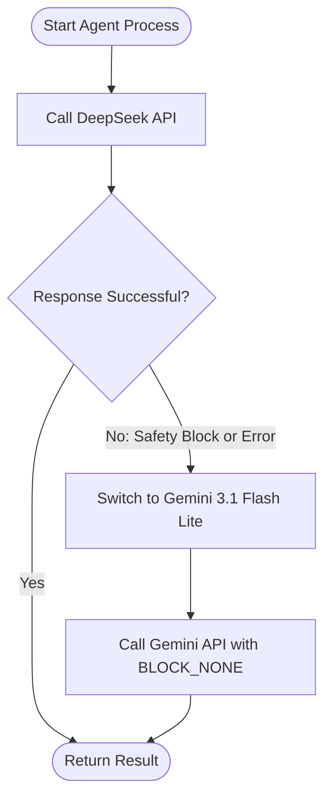

# Development Plan: RAG-based Workflow & API Stack Refactoring

This document outlines the architectural upgrade of the light novel translation workflow. We are transitioning to a RAG-enabled system to improve vocabulary retrieval accuracy, translation memory consistency, and safety handling when translating sensitive content (such as sexual, violent, and cruel depictions).

---

## 1. Updated Model & API Stack

The previous Qwen "Coding Plan" API is decommissioned. The new stack prioritises specialised translation performance and resilient safety handling:

*   **Initial Translation Agent**: Local/Cloud-deployed **Sakura-14B-Qwen2.5-v1.0-GGUF** (running at `127.0.0.1:6006`). Highly optimised for Japanese-to-Chinese light novel translation and ACG cultural terminology.
*   **Logic Auditor (Proofreader Agent)**: **deepseek-v4-flash** API as primary (ensures fast responses and stable JSON output).
*   **Stylistic Polisher Agent**: **deepseek-v4-pro** API as primary (ensures high creative writing quality).
*   **Safety Fallback (Proofreader & Polisher)**: **Gemini 3.1 Flash Lite** API with `BLOCK_NONE` safety settings. Automatically active when DeepSeek triggers a safety block on explicit content.
*   **Vector Embeddings**: **Gemini Embedding 2** API for semantic search and bilingual sentence matching.

---

## 2. RAG Knowledge Architecture

Instead of feeding large, static reference files into the context window of every model call, the system dynamically retrieves only relevant context at the chapter level.

### A. Translation Memory (TM) Database
*   **Storage**: A single local file `Knowledge/translation_memory.json`.
*   **Format**: Stores paragraph-level mappings alongside pre-computed embedding vectors to eliminate redundant API calls at startup:
    ```json
    {
      "chapters": {
        "chapter_filename.md": [
          {
            "raw": "突然だが、俺は转生者である。",
            "translated": "虽然很突然，但我是转生者。",
            "embedding": [0.012, -0.045, 0.089, ...]
          }
        ]
      }
    }
    ```
*   **Retrieval**: Computes embeddings for the target raw chapter's paragraphs, matches the top 2-3 most similar Japanese paragraphs from the TM using cosine similarity, and retrieves their corresponding Chinese translations as few-shot translation examples.
*   **Incremental Update**: Successfully translated chapters automatically append their paragraph pairs and newly computed embeddings to the TM database.

### B. Glossary Hybrid Retrieval & GPT Dictionary Formatting
To prevent translation contamination where SakuraLLM inserts detailed explanations directly into dialogues, glossary entries matched for a chapter are parsed using a cleaning heuristic before format generation:
*   **Parsing Logic**:
    *   For keys like `"ネトラレラ (Netorarera)"` -> Extract `"ネトラレラ"` as `src`, and `"Netorarera"` as metadata.
    *   For values like `"努力豆（マメ本意为...） / 老茧"` -> Identify `/` or parentheses to split the term. Extract the first concise term (`"努力豆"` or `"老茧"`) as the direct translation `dst`. The rest of the explanation is assigned to the `info` metadata field.
*   **Formatting Logic**:
    *   The cleaned terms are mapped to `gpt_dict` items containing `src`, `dst`, and optionally `info`.
    *   If the glossary is not empty, it builds the user prompt:
        ```
        根据以下术语表（可以为空）：
        [src_1]->[dst_1] #[info_1]
        [src_2]->[dst_2]
        将下面的日文文本根据对应关系和备注翻译成中文：[japanese]
        ```
    *   If the glossary is empty:
        ```
        将下面的日文文本翻译成中文：[japanese]
        ```

### C. Partitioned Guidelines Retrieval
*   **Storage**: `Knowledge/guidelines.txt`.
*   **Retrieval**: Parses the guidelines into two blocks:
    1.  *Global Guidelines*: General tone, character descriptions, and core constraints.
    2.  *Chapter-specific Guidelines*: Extracted dynamically using chapter number matching (e.g. `《翻译指导原则》- [第 12 章]`).
*   **Fallback**: If no chapter-specific guidelines exist, it falls back to semantic similarity matching to find relevant guidelines from adjacent chapters.

---

## 3. Formatting Integrity & Alignment Verification

To prevent translation omission or paragraph merging errors across different LLM calls:
*   **Line-Count Assertion**: The pipeline compares the raw input paragraph count with the translated, proofread, and polished outputs. If a mismatch is detected, it triggers a warning and a local retry.
*   **Punctuation Preservation**: The translation must keep Japanese-style quote marks (`『』` and `「」`) and preserve line breaks/formatting structure 1:1.

---

## 4. Dual-Track Safety Fallback Design

To prevent execution failures caused by DeepSeek content filters on explicit scenes:



---

## 5. Execution Phases

### Phase 1: Build Database Initialisation Tool
*   Develop `scripts/align_chapters.py` to align paragraph structures of existing translated chapters (1-18) in `生肉` and `熟肉`.
*   Call Gemini Embedding 2 API to generate and cache vectors for these paragraphs.
*   Save the compiled index to `Knowledge/translation_memory.json`.

### Phase 2: Implement RAG Retrieval Module & Glossary Parser
*   Develop `rag_engine.py` containing:
    *   Vector search utilities using `numpy` cosine similarity.
    *   Heuristic parsing rules to extract clean `dst` and `info` fields from `Glossary.json`.
    *   Chapter-based Guideline partitioning rules.
    *   Incremental update logic for new translations.

### Phase 3: Refactor Translation Pipeline
*   Update `pipeline.py` to integrate `rag_engine.py` and enforce ChatML prompt formatting for SakuraLLM at `127.0.0.1:6006`.
*   Replace old DashScope client bindings with DeepSeek (`deepseek-v4-flash` / `deepseek-v4-pro`) API calls.
*   Implement formatting assertions and the automatic try-except fallback to Gemini 3.1 Flash Lite in `UnifiedAgent.call`.

### Phase 4: Verification
*   Translate next raw chapters and verify:
    *   Translation Memory accurately injects matched translation styles.
    *   Context window usage remains low.
    *   Safety fallback triggers successfully and completes without censorship blocks on sexually explicit passages.
    *   Punctuation and paragraph counts are preserved 1:1.

---

## 6. QA Verification Checklist

*   [ ] `translation_memory.json` initialised and cached with paragraph vectors.
*   [ ] Sakura API endpoint translates raw text using the ChatML template and GPT dictionary format.
*   [ ] Guidelines context window size reduced from 160KB to less than 10KB per call.
*   [ ] Dual-track safety fallback successfully bypasses content safety flags on explicit scenes.
*   [ ] Translated files strictly use glossary names matching `Glossary.json` rules.
*   [ ] Final output preserves original paragraph line counts and punctuation marks.
